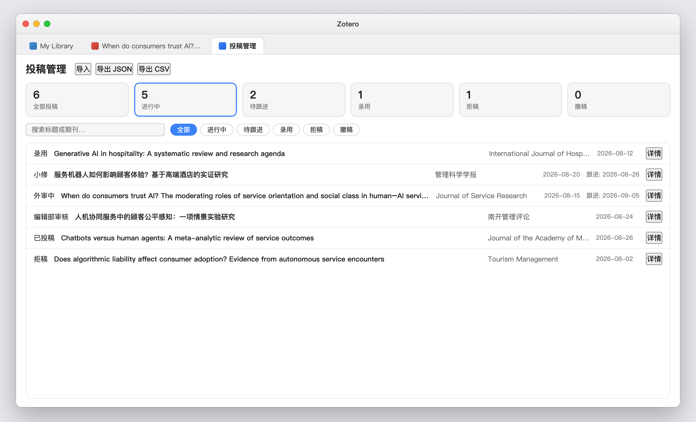
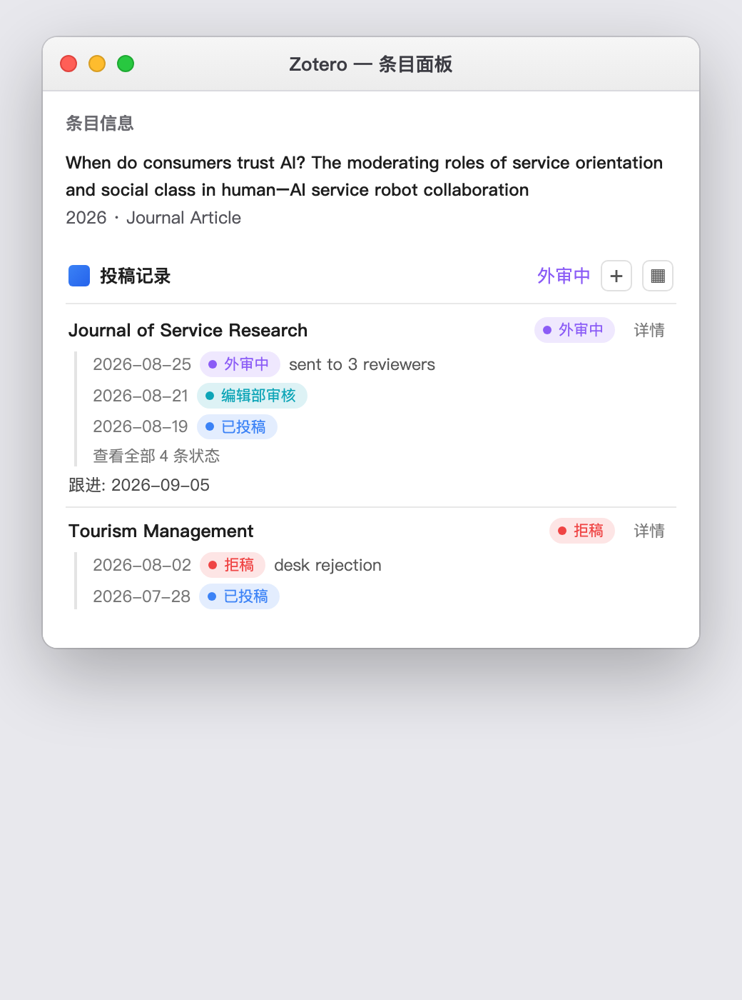

# Submission Tracker · 投稿追踪

[](https://www.zotero.org)
[](https://github.com/longkou1988/zotero-submission-tracker/releases)
[](LICENSE)

在 Zotero 中跟踪论文的期刊投稿全流程：多次投稿、状态流转时间线、跟进提醒、全局投稿管理面板。
Track journal submission records for your manuscripts right inside Zotero: multiple rounds, status timelines, follow-up reminders, and a dashboard.

| 投稿管理面板 Dashboard                  | 条目面板区块 Item Pane Section         |
| --------------------------------------- | -------------------------------------- |
|  |  |

| 添加投稿 Add Submission                          |
| ------------------------------------------------ |
|  |

---

## 中文

### 功能

- **条目面板「投稿记录」区块**：选中文献即可查看投稿状态徽章、状态流转时间线和跟进日期（逾期红色高亮），支持一键新增投稿
- **右键快速入口**：选中文献 → 右键「投稿记录 → 添加投稿记录」，支持多选批量添加
- **条目列表「投稿状态」列**：彩色状态徽章一目了然（右键列标题 → 在列选择器中开启）
- **投稿管理面板**：在 Zotero 内以标签页打开——统计卡片（全部 / 进行中 / 待跟进 / 录用 / 拒稿 / 撤稿）、搜索、状态筛选，点击记录跳转到对应文献
- **状态流转留痕**：草稿 → 已投稿 → 编辑部审核 → 外审中 → 大修 / 小修 → 录用 / 拒稿 / 撤稿，每次变更记录日期与备注，完整历史可回溯
- **跟进提醒**：为投稿设置跟进日期，到期或逾期时启动 Zotero 会弹出提醒
- **期刊名自动补全**：基于历史投稿记录
- **导入 / 导出**：CSV（UTF-8 BOM，Excel 友好）与 JSON 备份 / 恢复
- **双语界面**：简体中文 / English，深浅色主题自适应

### 安装

1. 从 [Releases](https://github.com/longkou1988/zotero-submission-tracker/releases) 下载最新的 `submission-tracker-*.xpi`
2. Zotero → 工具 → 插件 → 齿轮图标 →「Install Add-on From File…」→ 选择 xpi
3. 选中一篇文献，右键「投稿记录 → 添加投稿记录」开始使用

### 使用

1. **添加投稿**：选中文献 → 右键「投稿记录」→「添加投稿记录」，填写期刊（自动补全）、状态、日期与跟进日期
2. **更新状态**：收到期刊回复后，在条目面板「投稿记录」区块点击期刊名或「详情」→「记录状态变更」，选择新状态并写备注
3. **全局管理**：菜单栏 工具 → 打开投稿管理，查看统计、筛选和跟进
4. **设置**：Zotero 设置 → Submission Tracker——跟进提醒开关、可选「同步状态摘要到条目 Extra 字段」

### 数据与隐私

- 投稿记录保存在本机 Zotero 数据目录的 `zotero.sqlite` 中的两张插件表（`submissiontrackerSubmissions` / `submissiontrackerEvents`），**不上传任何数据、不发任何网络请求**（插件更新检查除外）
- 数据不随 Zotero 官方同步；换机器请使用「导出 JSON → 导入 JSON」迁移

### 从旧版本（≤ 0.1.25）升级

0.2.0 是一次彻底重构：数据从 JSON 文件迁移到 `zotero.sqlite` 插件表，界面重做为条目面板区块 + 内置标签页面板。**旧版本的 JSON 数据不会自动迁移**；如需保留旧记录，请在旧版本中导出 CSV 备查。同一插件 ID 直接覆盖升级，无需卸载旧版。

### 开发

基于 [zotero-plugin-template](https://github.com/windingwind/zotero-plugin-template)（TypeScript + esbuild + zotero-plugin-scaffold）。

```sh
npm install
cp .env.example .env   # 配置本机 Zotero 路径与 profile 路径
npm start              # 构建并以热加载模式启动 Zotero 调试
npm run build          # 产出 .scaffold/build/*.xpi
```

在 Zotero 中可通过 `Zotero.SubmissionTracker.api` 访问编程接口（`db`、`openDashboard`、`openCreateDialog`、`checkFollowUps`）。

## English

### Features

- **Item pane "Submission Records" section**: status badge, status timeline and follow-up date (overdue in red) for the selected item; add submissions with one click
- **Right-click entry**: select items → "Submission Records → Add Submission Record"; batch supported
- **Item list "Submission Status" column**: colored status badges (enable via the column picker)
- **Submission dashboard**: opens as a tab inside Zotero — stat cards (total / in progress / to follow up / accepted / rejected / withdrawn), search, status filters, click a row to jump to the item
- **Full audit trail**: Draft → Submitted → With Editor → Under Review → Major/Minor Revision → Accepted / Rejected / Withdrawn, each change recorded with date and note
- **Follow-up reminders**: set a follow-up date per submission; Zotero shows a reminder when it is due
- **Journal name autocomplete** based on your history
- **Import / export**: CSV (UTF-8 BOM, Excel friendly) and JSON backup / restore
- **Bilingual UI**: 简体中文 / English; adaptive to light & dark themes

### Installation

1. Download the latest `submission-tracker-*.xpi` from [Releases](https://github.com/longkou1988/zotero-submission-tracker/releases)
2. In Zotero: Tools → Plugins → gear icon → "Install Add-on From File…" → pick the xpi
3. Right-click an item → "Submission Records → Add Submission Record" to get started

### Usage

1. **Add a submission**: select an item → right-click → "Submission Records" → "Add Submission Record"
2. **Update status**: when the journal replies, open the record from the item pane section (click the journal name or "Details") → "Record Status Update"
3. **Dashboard**: Tools → Open Submission Dashboard for stats, filters and follow-ups
4. **Preferences**: Zotero Settings → Submission Tracker — reminder toggle and an optional status mirror into the item "Extra" field

### Data & privacy

- Records live in two plugin tables (`submissiontrackerSubmissions` / `submissiontrackerEvents`) inside your local `zotero.sqlite`. **No data leaves your machine**; no network requests except plugin update checks
- Data does not sync with Zotero's official sync; migrate with "Export JSON → Import JSON"

### Upgrading from ≤ 0.1.25

0.2.0 is a full rewrite: storage moved from JSON files to plugin tables in `zotero.sqlite`, and the UI was redesigned around an item pane section plus an in-tab dashboard. **Old JSON data is not migrated automatically.** The add-on ID is unchanged, so installing the new xpi upgrades in place.

### Development

Built on [zotero-plugin-template](https://github.com/windingwind/zotero-plugin-template) (TypeScript + esbuild + zotero-plugin-scaffold). See the Chinese section above for commands; the programming API is available at `Zotero.SubmissionTracker.api`.

## License

[AGPL-3.0-or-later](LICENSE) · Copyright © 2026 kouzi
