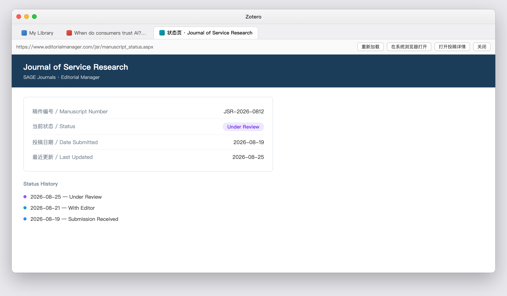

# Submission Tracker · 投稿追踪

[](https://www.zotero.org)
[](https://github.com/longkou1988/zotero-submission-tracker/releases)
[](LICENSE)

在 Zotero 中管理论文从准备投稿、编辑处理、外审、修回到录用 / 拒稿的完整流程，并提供投稿分析、智能下一步建议、催稿助手、跟进提醒和分类归档。

Manage the full journal-submission workflow inside Zotero — from preparation and submission to editorial handling, peer review, revision, acceptance or rejection — with analytics, smart next actions, inquiry assistance, reminders, and collection-aware organization.

> **Latest release / 最新版本：v0.6.1**  
> 修复“投稿分析 → 期刊表现”区域在部分 Zotero 窗口宽度下被压缩的问题。  
> Fixes the Journal Performance panel shrinking in Submission Analytics on some Zotero window sizes.

[下载最新版 / Download latest release](https://github.com/longkou1988/zotero-submission-tracker/releases/latest)

---

## 界面总览 · Interface Overview

| 投稿管理面板 Submission Dashboard | 条目面板区块 Item Pane Section |
| --- | --- |
|  |  |

| 添加投稿 Add Submission | 状态页快捷入口 Status Page Tab |
| --- | --- |
|  |  |

> 截图用于展示主要交互结构；v0.6.x 已在此基础上新增“投稿分析 Dashboard”、Collection 分类选择、下一步建议与催稿助手，具体布局可能与旧截图略有差异。  
> Screenshots illustrate the core interaction model. v0.6.x additionally includes Submission Analytics, collection selection, Smart Next Action, and Inquiry Assistant, so minor layout differences may exist.

### 当前主要界面 · Current Main Views

| 界面 / View | 入口 / Entry | 用途 / Purpose |
| --- | --- | --- |
| 投稿管理 / Submission Dashboard | `工具 → 打开投稿管理` / `Tools → Open Submission Dashboard` | 全局查看投稿、搜索、筛选、跟进与状态页入口 / Global records, search, filters, follow-up and status-page access |
| 投稿分析 / Submission Analytics | `工具 → 投稿分析` / `Tools → Submission Analytics` | KPI、结果分布、年度趋势、期刊表现和交互下钻 / KPIs, outcome distribution, yearly trend, journal performance and drill-down |
| 投稿详情 / Submission Details | 条目面板或 Dashboard 中点“详情” / Open from item pane or dashboard | 状态时间线、稿件编号、网址、跟进日期、备注 / Timeline, manuscript ID, URL, follow-up date and notes |
| 下一步建议 / Smart Next Action | 投稿记录菜单 / Submission Records menu | 根据当前状态和等待时长给出下一步动作 / Recommends the next action from status and elapsed time |
| 催稿助手 / Inquiry Assistant | 投稿记录菜单 / Submission Records menu | 本地生成中英文催稿邮件模板 / Generates Chinese and English inquiry templates locally |
| 添加投稿 / Add Submission | 右键文献 → 投稿记录 → 添加投稿记录 / Right-click item → Submission Records → Add Submission | 新建投稿并选择保存到 Zotero Collection / Create a submission and choose its Zotero Collection |

---

# 中文

## v0.6.x 主要功能

### 1. 投稿全流程管理

支持 9 种投稿状态：

`草稿 → 已投稿 → 编辑部审核 → 外审中 → 大修 / 小修 → 录用 / 拒稿 / 撤稿`

每次状态变化都可以记录日期与备注，形成完整时间线。每条投稿独立管理，不会因为同一篇论文多次改投而互相覆盖。

### 2. 投稿分析 Dashboard

`工具 → 投稿分析` 可打开独立分析页面，所有统计均基于本机投稿记录实时计算：

- **核心指标**：总投稿、进行中、已录用、已拒稿、录用率、拒稿率、平均首次决定时间
- **投稿结果分布**：环形图展示进行中 / 录用 / 拒稿 / 撤稿
- **年度投稿趋势**：按年份查看投稿数量变化
- **期刊表现**：按期刊统计投稿次数、录用、拒稿、平均首次决定时间
- **交互筛选**：年份 + 状态 + 期刊可组合筛选
- **图表下钻**：点击 KPI、环形图、年份柱状图或期刊即可直接筛选对应投稿
- **投稿记录列表**：筛选后的稿件直接显示在分析页底部，并可打开详情

录用率 / 拒稿率仅以已有明确结果的投稿作为分母：

`录用率 = Accepted ÷ (Accepted + Rejected)`

大修、小修、进行中和撤稿不会被错误计算为最终结果。

### 3. Smart Next Action · 下一步建议

插件会根据当前投稿状态、跟进日期和等待时长，给出下一步建议，例如：

- 等待编辑部处理
- 等待外审结果
- 长时间无更新时建议查看状态页或礼貌询问
- 优先准备修改稿与逐点回复
- 录用后关注校样、版权协议和正式上线
- 拒稿后评估修改重投或改投

该功能完全基于本地规则运行，不调用 AI 或第三方服务。

### 4. Inquiry Assistant · 催稿助手

对于适合询问编辑部的投稿，可生成：

- **英文催稿邮件**
- **中文参考版本**
- 自动带入期刊名、稿件编号和等待时长等已有信息
- 一键复制

如果当前阶段不适合催稿，插件会提示先查看“下一步建议”。

### 5. Zotero Collection 分类保存

新增投稿时支持选择“保存到分类”：

- 默认识别当前选中的 Zotero Collection
- 可手动切换到任意现有分类
- 支持嵌套分类完整路径
- 可保存到“资料库根目录”
- 会记住上一次有效选择
- 同时兼容 Zotero 7–10 的 Collection 选择方式

这样可以把不同研究项目、论文或年度投稿分别归入自定义分类，而不是所有投稿都堆在资料库根目录。

### 6. Zotero 废纸篓联动

投稿条目移入 Zotero 废纸篓后：

- 自动从投稿分析中隐藏
- 从废纸篓恢复后重新进入统计
- 只有永久删除时才真正清理对应投稿记录

避免误删条目时丢失投稿历史。

### 7. 投稿管理面板

全局 Dashboard 支持：

- 投稿记录集中查看
- 状态筛选与搜索
- 跟进日期与逾期提示
- 稿件编号
- 投稿系统状态页
- 最近查看状态页时间
- 直接进入投稿详情

### 8. 状态页快捷入口

每条投稿可以保存：

- 投稿系统状态页网址
- Manuscript ID / 稿件编号
- 最近查看时间

点击后直接在 Zotero 标签页中打开期刊投稿系统，无需切换到外部浏览器。

### 9. 跟进提醒

可以为每条投稿设置跟进日期。到期或逾期时，Zotero 启动后会提醒；Dashboard 中也会显示需要关注的记录。

### 10. 其他功能

- 条目面板“投稿记录”区块
- 条目列表“投稿状态”列
- 期刊名历史自动补全
- CSV 导出
- JSON 备份 / 恢复
- 简体中文 / English 双语界面
- 深色 / 浅色主题自适应
- 本机 SQLite 数据存储

## 安装

1. 打开 [GitHub Releases](https://github.com/longkou1988/zotero-submission-tracker/releases/latest)
2. 下载 `submission-tracker.xpi`
3. Zotero → **工具 → 插件 → 齿轮图标 → Install Add-on From File…**
4. 选择下载的 `.xpi`
5. 重启 Zotero（如 Zotero 提示需要）

## 快速开始

1. **添加投稿**：选中一篇文献 → 右键 **投稿记录 → 添加投稿记录**
2. 填写期刊、投稿状态、日期、跟进日期、稿件编号和投稿网址
3. 在 **保存到分类** 中选择目标 Zotero Collection
4. 保存后会创建对应的投稿追踪条目
5. 收到编辑或审稿意见后进入“详情”记录状态变化
6. 使用 **工具 → 投稿分析** 查看统计与趋势
7. 使用 **下一步建议** 判断当前最合适的行动；必要时打开 **催稿助手**

## 数据与隐私

- 投稿数据保存在本机 Zotero 数据目录中的插件 SQLite 表
- **不会上传投稿数据**
- Smart Next Action 和 Inquiry Assistant 都在本机运行，不调用 AI API
- 插件本身不会读取或上传你的论文全文
- 用户主动打开“状态页”时才会访问对应期刊网站
- Zotero 插件更新检查需要访问 GitHub Release / update manifest
- 投稿数据库目前不随 Zotero 官方同步；跨设备迁移建议使用 JSON 导出 / 导入

## 从旧版本升级

同一插件 ID 可直接覆盖升级，无需先卸载。

如果从非常早期版本（≤ 0.1.25）升级：0.2.0 起数据结构已经迁移到 `zotero.sqlite` 插件表，早期 JSON 数据不会自动迁移，建议先保留旧版导出备份。

---

# English

## Highlights in v0.6.x

### 1. Full Submission Workflow

Track nine submission states:

`Draft → Submitted → With Editor → Under Review → Major / Minor Revision → Accepted / Rejected / Withdrawn`

Every status change can store a date and note, creating a complete submission timeline. Each submission attempt is tracked independently, which is especially useful when a manuscript is resubmitted to another journal.

### 2. Submission Analytics Dashboard

Open **Tools → Submission Analytics** to analyze all locally recorded submissions:

- **KPIs**: total, active, accepted, rejected, acceptance rate, rejection rate, average first-decision time
- **Outcome distribution**: donut chart for active / accepted / rejected / withdrawn
- **Yearly trend**: submission volume by year
- **Journal performance**: submissions, accepted, rejected, and average first-decision time by journal
- **Interactive filters**: combine year + status + journal
- **Chart drill-down**: click KPIs, donut segments, year bars, or journals to filter records
- **Filtered record list**: open submission details directly from the analytics page

Acceptance and rejection rates only use submissions with a final decided outcome:

`Acceptance Rate = Accepted ÷ (Accepted + Rejected)`

Active, revision, and withdrawn submissions are not incorrectly treated as final outcomes.

### 3. Smart Next Action

The plugin recommends the next action from the current status, follow-up date, and elapsed time, for example:

- wait for editorial handling
- wait for peer review
- check the status page or send a polite inquiry after a long quiet period
- prioritize revision and point-by-point responses
- follow proof, copyright, and publication steps after acceptance
- evaluate revision and resubmission after rejection

This feature is rule-based and runs entirely locally. No AI or third-party service is called.

### 4. Inquiry Assistant

For submissions where an inquiry is appropriate, the plugin can generate:

- an English inquiry email
- a Chinese reference version
- journal name, manuscript ID, and elapsed time from existing records
- one-click copy

If an inquiry is not recommended at the current stage, the plugin directs you back to Smart Next Action.

### 5. Zotero Collection-aware Placement

When creating a submission, **Save to Collection** lets you:

- default to the currently selected Zotero Collection
- manually choose any existing Collection
- see full paths for nested Collections
- save to the library root
- reuse the last valid selection
- work across Zotero 7–10 Collection-selection APIs

This makes it easier to organize submissions by project, manuscript, year, or any custom Zotero structure.

### 6. Zotero Trash Integration

When a submission item is moved to Zotero Trash:

- it is automatically excluded from analytics
- restoring it makes it visible again
- the plugin record is permanently cleaned only after the Zotero item is permanently deleted

This avoids losing submission history because of an accidental delete.

### 7. Submission Dashboard

The main dashboard provides:

- centralized submission records
- search and status filters
- follow-up and overdue indicators
- manuscript IDs
- journal status-page links
- last-checked timestamps
- direct access to submission details

### 8. Status Page Quick Access

Each submission can store:

- journal submission-system URL
- Manuscript ID
- last-checked timestamp

Open the status page directly in a Zotero tab without switching to an external browser.

### 9. Follow-up Reminders

Set a follow-up date for each submission. Zotero can notify you when a record is due or overdue, and the dashboard surfaces records that need attention.

### 10. Additional Features

- Item pane **Submission Records** section
- Item list **Submission Status** column
- journal-name autocomplete from submission history
- CSV export
- JSON backup / restore
- Simplified Chinese / English UI
- adaptive light / dark theme
- local SQLite storage

## Installation

1. Open the [latest GitHub Release](https://github.com/longkou1988/zotero-submission-tracker/releases/latest)
2. Download `submission-tracker.xpi`
3. In Zotero: **Tools → Plugins → gear icon → Install Add-on From File…**
4. Select the `.xpi`
5. Restart Zotero if prompted

## Quick Start

1. Select a manuscript item → right-click → **Submission Records → Add Submission Record**
2. Enter journal, status, date, follow-up date, manuscript ID, and status-page URL
3. Choose the destination under **Save to Collection**
4. Save to create the submission tracking item
5. Record later status changes from **Details**
6. Open **Tools → Submission Analytics** for metrics and trends
7. Use **Smart Next Action** for the recommended next step and **Inquiry Assistant** when appropriate

## Data & Privacy

- Submission records are stored in plugin SQLite tables inside the local Zotero data directory
- **Submission data is not uploaded**
- Smart Next Action and Inquiry Assistant run locally and do not call AI APIs
- The plugin does not upload or analyze your manuscript full text
- Network access occurs only when you explicitly open a journal status page or when Zotero checks for plugin updates
- Submission records do not currently sync through Zotero Sync; use JSON export / import when moving between machines

## Upgrading

The add-on ID is unchanged, so newer versions can be installed directly over older versions.

For very old versions (≤ 0.1.25), note that storage was migrated to plugin tables in `zotero.sqlite` starting with v0.2.0. Legacy JSON data is not migrated automatically; keep an export backup before upgrading.

---

## Development · 开发

Built on [zotero-plugin-template](https://github.com/windingwind/zotero-plugin-template) with TypeScript, esbuild, zotero-plugin-scaffold, and zotero-plugin-toolkit.

```sh
npm install
cp .env.example .env
npm start
npm run test:unit
npm run lint:check
npm run build
```

Programming API / 编程接口：`Zotero.SubmissionTracker.api`

## License

[AGPL-3.0-or-later](LICENSE) · Copyright © 2026 kouzi
